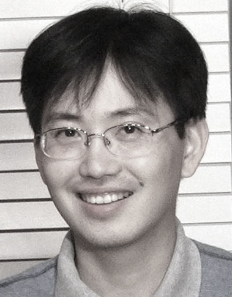

I am a professor in the Department of Computer Science and Engineering at Texas A&amp;M University. I am generally interested in the brain, mind, and intelligence. My areas of research include computational neuroscience, brain imaging and analysis, neuroevolution, and neural networks (including deep learning).

### Experience
* Professor, [Department of Computer Science and Engineering](https://www.cs.tamu.edu), [Texas A&M University](https://www.tamu.edu), September 2014–Present
* Corporate Vice President, [Samsung Research](https://research.samsung.com), July 2017–December 31, 2019
* Associate Professor, Department of Computer Science and Engineering, Texas A&M University, September 2007–August 2014
* Assistant Professor, Department of Computer Science, Texas A&M University, September 2001–August 2007
* Member, Graduate Faculty, School of Graduate Studies, Texas A&M Health Science Center, June 2011–Present (CSCE students: do not count me as an external member of your M.S./Ph.D. committee)
* Director, [Brain Networks Laboratory](https://people.engr.tamu.edu/choe/choe/bnl/home.html) (at Texas A&M), September 2005-Present (Member: September 2001-2004).
* Intern, HNC Software Inc. (now (FICO)[https://en.wikipedia.org/wiki/FICO]), San Diego, CA. Summer 1999.

### Education
* Ph.D. in Computer Science, The University of Texas at Austin, Austin, TX, August 2001.
* M.A. in Computer Science, The University of Texas at Austin, Austin, TX, December 1995.
* B.S. in Computer Science, Yonsei University, Seoul, Korea, August 1993.
* [Academic genealogy](/genealogy/)

### Contact
* Address: 3112 TAMU, College Station, TX 77843-3112.
* Office: PETR 327
* Phone: 979-845-5466 (rarely used)
* email: choe@tamu.edu
